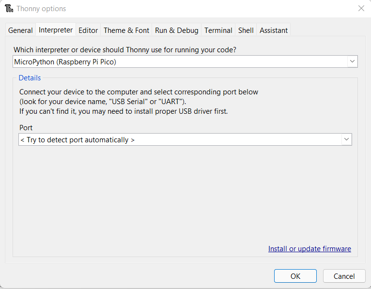

# annoying_plant

Project is WIP

---

## About
---

This is a talking plant project requiring a RaspberryPi Pico a DFPlayer-mini module as well as a DS-3231 RTC-module (Real time clock).
The main purpose of the project is a beginner friendly DIY experience.
Using Python as a quite easy language to learn and very simple basic modules and circuits.
It should give a small insight into the world of microcontrollers and what they are capable of.
 
I provided a short BASICS summary, to explain briefly basic functionalities in Python and electronics.

---
## Content
---

- Parts
- Main Project
- Basic
-
-

---

## Parts

---

- RaspberryPi Pico
- Zs-042 (DS3231 RTC)
- CD40107BE (2x NAND IC)
- DFPlayer-mini, speaker & microSD-card
- capacitive soil moisture sensor
- Basic components:
    * IRF4905 P-Mos
    * 2n2222a NPN
    * 2x 100nF Capacitor
    * Resistors YYYYYYYYYYY
    * LED's (optional)

---
## Main project
---
TEXT TEXT TEXT TEXT TEXT TEXT TEXT TEXT TEXT TEXT TEXT TEXT TEXT TEXT TEXT TEXT TEXT TEXT TEXT TEXT TEXT TEXT TEXT TEXT TEXT TEXT TEXT TEXT TEXT TEXT TEXT TEXT TEXT TEXT TEXT TEXT TEXT TEXT TEXT TEXT TEXT TEXT TEXT TEXT TEXT TEXT TEXT TEXT TEXT TEXT TEXT TEXT TEXT TEXT TEXT TEXT TEXT TEXT TEXT TEXT TEXT TEXT TEXT TEXT TEXT TEXT TEXT TEXT TEXT 

---
## Basics
---

---
### Safety
---

The project is powered by a 5V USB cable or a 9V Block-battery. With this Voltages you don't need to worry when touching something active powered. The resistance of our skin is typically high enough so you wont feel any effects of the small current flowing through your boddy.  
Wrongly connect or shorting the circuit can ruin some parts, but you typically will notice them gettin warm first which leaves you sometimes enough time to unplug whatever you might have missconnected. If you follow the instructions you should be on the save side, althugh i garuantee nothing.

---
### Electronic Basics
---
If you are somewhat experienced you can skip this part, as it is mainly to explain the basic function of commonly used electronic parts.

#### ***Ohm's law:***

Probably the most common basic is that electric energy flow in form of electrons from higher to lower voltage levels. The amount of current flowing through your wires is depending on the resistance of the path the electrons are traveling. This leads to a well-known and basic formula:

 

<pre><code>U=R*I
U is our voltage, R is the value of our resistance in ohm and I stand for the amount of current in ampere.

</code></pre>

That to be said let’s think about that law quickly, everything including wires have a certain value for resistance. With a shorted wire from voltage source to ground we usually can expect almost infinite amount of energy to flow (wire resistance really low - close to 0) dependend of outputcapability of the source.   When we add an resistor with let’s say 1000 ohm and our source provides 5V like every USB plug, a current of 0.001 ampere should flow (1mA). The formula used for this comes from Ohm's law I=U/R as you can see this simple formula is quite easy to use and will appear quite often from now on.  
I want to add a short reminder on how to calculate resistance. Resistors in series can be added together. For parallel resistors it’s a little different and more complicated, [see](https://en.wikipedia.org/wiki/Resistor).

#### ***Electronic components:***

Only some important parts are listed for this project.
- [**Resistor:**](https://en.wikipedia.org/wiki/Resistor) A resistor is a passive electrical component that implements electrical resistance as a circuit element. In electronic circuits, resistors are used to reduce current flow, adjust signal levels, to divide voltages and many other uses.  
The resistance value of the part is given in ohm.  
*Example:*  Limiting the amount of current flowing through LED's or Pulling Wires to a certain level while not shorting the circuit. For example, if something needs a signal default High on the input it can be realized with a Pull-up resistor to the supply voltage. This prevent a short circuit if the pin is switched low.
- [**Transistor:**](https://en.wikipedia.org/wiki/Transistor) The electronic equivalent of a switch. With two main categories, MOSFET  and Bipolar. Both of them comes with N- and P-doped variants. The range of application is wide. They can be used as amplifier or simply as switches. For our purpose only the use of as switch (in saturation) is relevant.  
*Example:* Using an Npn bipolar transistor we could switch High currents directly from the source. Without risk to damage a Pin of the microcontroller due to overload.
- [**Diode:**](https://en.wikipedia.org/wiki/Diode) Is an electrical component that allow current to flow only in one direction.  
*Example:* Often used as rectifiers. A special case among diodes are LED, when current flows through them they emit light of a certain wave length.
- [**Capacitor:**](https://en.wikipedia.org/wiki/Capacitor) Capacitors are Conducting plates parallel to each other. They are able to draw energy from a source and store it. Inside the two metal plates separated by a non-conducting substance. When activated, a capacitor quickly releases electricity in a tiny fraction of a second.  
*Example:* They can be used to flatten fluctuation supply. Placed close to the supply Pins of any IC (integrated circuit) a capacitor stabilize the IC’s voltage supply.

---
### Modules & ICs
---
#### DS3231 RTC Module

The DS3231 is a low-cost, extremely accurate I²C real-time clock (RTC) with an integrated temperature-compensated crystal oscillator. The device incorporates a batteryslott. When running this Module on active supply voltage and a battery, it is advised to remove either Resistor or the Diode itself or cut the wire inbetween them. Recharging a non-rechargeable battery is dangerous. It should be avoided at all costs.  

The Output Pins of the module are CMOS Open-Drain, so we need to add a Pull-up resistor to pull it on an active HIGH level for our microcontroller to notice it. In our case this would be the **SQW** pin.  

This would be true for our serial communication pins too (**SDA**, **SCL**) usually this is already implemented with the intern pullup's of the microcontroller.

The picture shows our module, with the diode and resistor mentioned above marked with a red arrow.  
- **32K** outputs a 32kHz signal
- **SQW/INT** outputs either a square wave signal or an interupt signal to wakeup our microController
- **SCL** Serial Clock, communication: i²c (inter integrated circuit)
- **SDA** Serial Data, communication: i²c
- **VCC** Supply Pin
- **GND** Ground Pin

 

#### NAND Gate

The signal levels 1 and 0 are ofthen called HIGH or LOW at some point, all of these are refering to the same levels (Supplay Voltage and GND).  

NAND stands for **not** **and**, what this mean can be shown in the truth table of this gate. Basically the output is always HIGH except when both inputs are HIGH. In the picture below A and B are the inputs while C is the output. The output also requires an pullup resistor to pull the signal level to HIGH as its cmos-open-drain nature.  

We use a CD40107BE IC the datasheet can be found in the docs folder, the truth table was also taken from the datasheet.  

A special use case for the NAND Gate is to invert incomming signals, when we combine the pins A and B it's inverting the signal we supply to the combination of the two. You also can see this in first and last lane of the truth table, where A and B are equal.  

We can now use this gate to create a flip flop. This is a special circuit designed to store a specific state as to 1 or 0 (HIGH or LOW) representing supply voltage level and ground level in most cases.

 

#### DF-mini-player

This module is able to drive an analoge speaker. It needs to be supplied with 3.2 - 5 Volts.
The file system supports up to 32GB on the microSD card. It can be controlled either by buttons on the hardware side or with commands through software.

 

  
1. Main directory
Up to 3000 wav or mp3 files can be stored in the main directory of the SD card. They must be saved as 0001.mp3 (or 0001.wav), 0002.mp3 …. 3000.mp3. The files are copied in the exact order of their names. Since they are there by creation time.

2. Default directories
You can create 99 standard directories, which follow the scheme 01, 02, 03 .... 99 must be named. In each of these folders, 255 files can be addressed directly using commands.

---
### RaspberryPi Pico
---

Raspberry Pi Foundation entrance in the world of microcontrollers. The company itself is well known for its single board computers. This much smaller module comes with a fairly good price. The difference between the bigger RaspberryPi's is that not supposed to be a whole computer. Therefore it comes with less computing power and programmable memory space and probably more important no Operating system. That to be said you program the function of the module on your own. It is also suitable for low power applications because it does not need that much power.
 
The technical aspects can be found in the Datasheet linked below:
The board itself is powered by a MicroUSB connection this refers also as VBUS Pin and need to be 5V. Powering directly at VSYS Pin in the range of 1.8-5.5 V is also possible. It is important to strictly following the datasheet here to avoid damage to our controller.  
The Pico is powered by the RP-2040 Chip sitting in the middle of the board, avoid touching the Pins of the Chip itself directly because electrostatic charge from your hands can damage it. To control the processor microPython or with a little effort C++ can be used, more to that later.
 
We can now program the Pin’s of the module to switch HIGH/LOW or read analog Signals (Voltage levels). This offers a wide range of possible applications which can be easy realized, we just need to be aware of some basic concepts to not risk damaging the module itself. Although it is usually quite resistant to little accidents in a certain extent.  
The Output capability of the Pico is limited (~20mA), for switching higher loads its important to not exceed the parts limits. For switching higher currents use rellais or transistors. Measure or apply negative voltages is neither a good idea because it can damage the part too. This should not be achievable without a propper voltage supply, except for accidentally mistake GND and VCC.  
For more information look at the Datasheet provided below, but more Important is the Pinout scematic, as it is shown there the number and type of our Pins.

 

[Pinout source](http://land-boards.com/blwiki/images/thumb/5/56/Raspberry-Pi-Pico-Pinout.jpg/730px-Raspberry-Pi-Pico-Pinout.jpg)

[Datasheet source](https://datasheets.raspberrypi.com/pico/pico-datasheet.pdf)

---
### microPython
---

MicroPython is a efficient implementation of the Python 3 programming language it is optimised to run on microcontrollers, like our Pico. It includes a small subset of the Python standard librarys, but its more than sufficient to the needs of this project.  
We will use Thonny to write our python code. Its a beginnerfriendly easy to use IDE perfectly fitting the needs to run all kinds of basic electronic projects.

 

latest version of [Thonny](https://thonny.org/)
 

---
## Lection 1: Installation & Blink sketch
---

If you have not already downloaded & installed [Thonny](https://thonny.org/) you should do this now.  
After the installation is complete click on **Run - select interpreter** like shown below.

Now select **MicroPython (Raspberry Pi Pico)**  
(In Case you seting up your Pico for the first time you need to hit the **'install or update firmware'** button on the lower right of following window.)

Now we can start to write the actual programm. Starting with a simple sketch to show basic functionality. Make sure your Pico is connected for the next steps. It should be select automatically the right port.
<pre><code>
#Hello World!
import time

ledpin = Pin(25, Pin.OUT) # here we declare the variable ledpin as Pin 25 in output mode

print("Hello World!") # this will print "Hello World!" to the console in our IDE, the message will be sent by the Pico over USB-serial interface

ledpin.value(1) # now we output a HIGH signal on the defined ledpin
time.sleep(1) # wait for 1 second, the controller wont do ANYTHING while this period of time
time.sleep_ms(1) # wait for 1 millisecond

ledpin.value(0) # pull ledpin LOW
</code></pre>

For more details on [time library](https://docs.micropython.org/en/latest/library/time.html) click the link.

Now click on save, there should now apper a window asking you where u want to save. Hit the button to save on the Pico like shown below. **Important** use the file ending .py when saving your programm!

When you hit the **Run** button the programm should start to execute on the Pico, if you want to stop the code hit the red **STOP**.

 

A better way to implement something similar is shown in blink.py from the code folder. Load it or copy the code manually into your ThonnyIDE.

<pre><code>
#import existing code
from machine import Pin, Timer

#declare pins & variables
led = Pin(25, Pin.OUT)  #initialize pin 25 and set it to output
LED_state = True        #declare a boolean variable
tim = Timer()           #initialize a timer module

#define a function to execute code at a certain callback event
def tick(timer):
    global led, LED_state       #get access to the global variables in function space
    LED_state = not LED_state   #inverting bool value
    led.value(LED_state)        #output the new state to our pin

#use Timer object to execute our callback function at 1Hz (1 per second)
tim.init(freq=1, mode=Timer.PERIODIC, callback=tick)
</code></pre>

When you save the code to your Pico this time give the file the name **main.py** , now the Pico will execute the code everytime it is powered on automatically. You should still be able to controll it by the **STOP** and **RUN** button while pluged to your PC.

---
## Lection 2: Flip flop
---

**Theory:**  
A Flip-flop is a bistable circuit saving a electronic state. It's fundamental circuit to store digital information. Even in games like Minecraft you can build such a thing pretty quickly.  
In the game you can build an inverter out of a redstone wire and a redstone torch attached to the block. When we connect two inverters this will form a Bistable state. Switching one of the buttons will cause the system to flip side and will stay that way untill the other button is pressed.  

In real world application the way this works is basically the same. This time wie connect two NAND-Gates together, which eventually forms our Flip-flop. There is one more important thing, a forbidden state exists when both inputs are activated at the same time. This state is not really dangerous in our case but you simply cant really tell how the circuit is gonna react to it, loosing correct state of the machine could cause problems.  

In the picture below the raw scematic of a real world Flip-flop is shown. The basic element of the circuit are 2 NAND-Gates, which we can see marked in red.  

**Circuit:**  
Now we gona build a small circuit to test this functionality. Our real-world implementatin of the FF reacts when one of the inputs is pulled low. So we simulate the press of a button by simply attatching lose wires, which we can connect manually to simulate a button press. In order to flip we have to pick the correct wire, either pink or violet and hold it onto the ground rail (black).   This could theoretically also achieved with our Pico. When we connect those two wires to output pins and set them to HIGH state. As soon as we pull the correct one LOW the FF should switch and the other LED should light up.  

The Resistors to protect the LED should be around 300 Ohm, they can be calculated according the formula or with online [tools](https://www.elektronik-kompendium.de/sites/bau/1109111.htm):

<pre><code>
protection Resistor = Voltage drop over R / I on LED
#Voltage drop over R can be obtained by subtracting forward drop Voltage of the Diode itself from source Voltage 
</code></pre>

The other two Resistors are 100kOhm to pull the signal level of the Nand output HIGH. This need to be done because of the open Drain nature of the NAND IC (Integrated Circuit).  

---
## Lection 3: DFPlayer-mini
---
For more detailed information on the module visit [here](https://wiki.dfrobot.com/DFPlayer_Mini_SKU_DFR0299). I already provided some information about it at the the Basics part, it is not mandatory to know all the details.  

Now we gona test the function of the DFPlayer module. Build your circuit on the breadboard according the scematic. 

Then you have to upload the 0001.mp3 file from the mp3 folder to the SD-card. The naming of the file is important to work with the selected library for this module.  
Load the dfplayer_example.py onto the Pico. When you look at the code you will notice that we import something, in this case this is not part of the standard library so we will need to deploy that code too on the Pico. Again simply save it with the correct name dfplayermini.py onto the controller.  
If you hit the play sign again it should start with the programm, in this case it should play the beginning of a song for about 15 seconds and then lower the volume until it reaches 0. Then the song should stop and the device should go back to sleep.  

See the code here: [dfplayer_example.py](./code/dfplayer_example.py)  

Changing the code is pretty simple i'll provide an example for each function of the library and how to use it:  
<pre><code>
code here follow soon!
</code></pre>

It is also possible to use this device manually. Take a loose wire connected to GND and tipp shortly on the **IO_2** Pin to select the next track. This will play the whole song. When holding these pins like its shown above in the Basic section, we can adjust the Volume. Therefor look at the Table there should be given a short description in the "Notes" of each pin how to controll it manually.